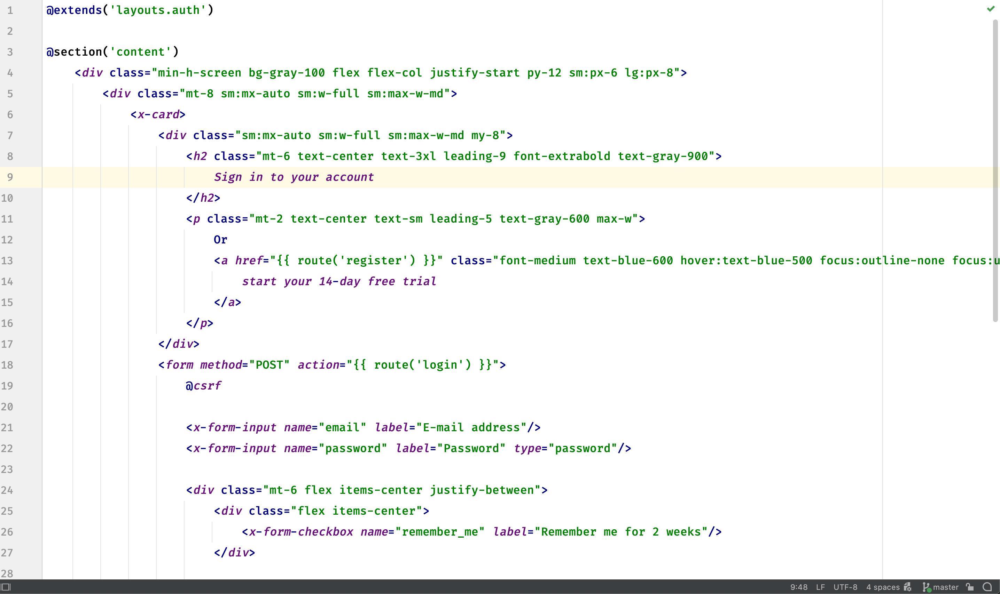
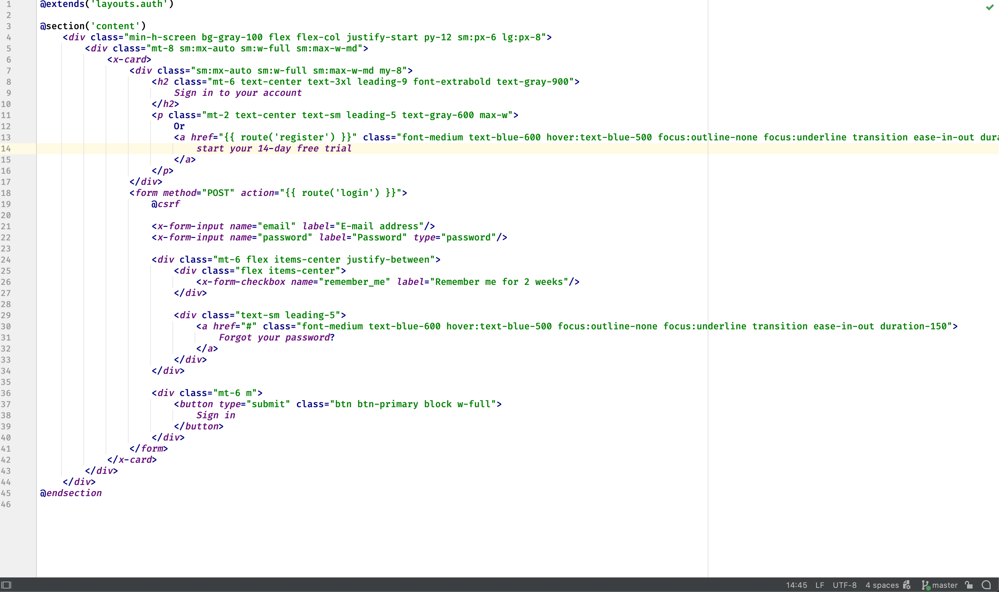

<h1 align="center">Intellij Scan Mode</h1>

Toggle font size and line spacing by keyboard shortcut. A plugin for IntelliJ based IDEs.

## Screenshots
Usual mode. Font size 16, line spacing 1.5.

 
Quickly toggle scan mode. Font size 12, line spacing 1.

