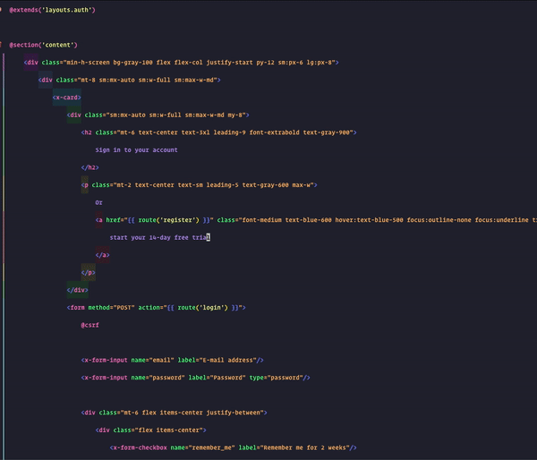

<h1 align="center">Intellij Scan Mode</h1>

Toggle font size and line spacing by keyboard shortcut. A plugin for IntelliJ based IDEs.

- To change font size and line spacing go to `Settings -> Tools -> Scan mode settings`
- To toggle it, click `View -> Appearance -> Enter scan mode (or Exit Scan mode)`.
- By default it is mapped to `alt+shift+S` but feel free to change it to whatever feels good for you.

## Screenshots

## Install

